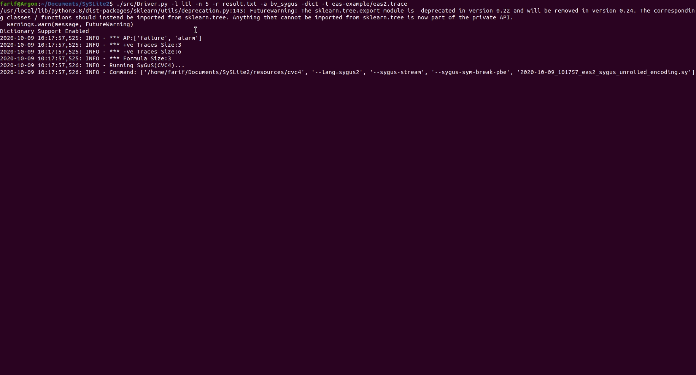

# SySLite2 
<sub>Syntax-Guided LTL and PLTL Synthesizer & Enumerator</sub>

SysLite makes use of decision and synthesis procedures (\ie `SAT`, `SMT`, and `SyGuS`) to learn `LTL  and Past-time LTL formulas` from infinite and finite set of example traces. These example traces describe the intended and unintended behavior in terms of positive and negative traces that can come from various application domains (i.e, security policy logs, protocols, and execution of a system or design model, among others). 
 
## Build & Test
Run commands on Terminal:

1. Build: `./tool-setup` (some machines may require running `apt-get install python3-venv` before `tool-setup`)
   * Continue? [Y]es/[N]o: Y 
   * Only required once to setup the tool  
2. Enable execution: `source env/bin/activate`
   * Required before executing the tool on a new terminal.  
3. Run: `./src/Driver.py --help`
4. Disable execution: `deactivate`
    
## Usage

An example trace file is added to learn back an emergency alert system (eas) formula. 

The trace [file](https://github.com/CLC-UIowa/SySLite/tree/master/eas-example/eas2.trace) contains    positive and negative (lass-shaped) traces that uses a format described below. 
Please use the command to synthesize LTL formulas using `bit-vector SyGuS` encoding:

`./src/Driver.py -l ltl -n 5 -r result.txt -a bv_sygus -dict -t eas-example/eas2.trace`



The trace [file](https://github.com/CLC-UIowa/SySLite/tree/master/eas-example/eas.trace) contains  
positive and negative finite-length traces that uses a format described below.

Please use the command to synthesize PLTL formulas using `bit-vector SyGuS` encoding:

`./src/Driver.py -n 5 -r result.txt -a bv_sygus -dict -t eas-example/eas.trace`


## Supported Algorithms:
The tool currently supports a list of algorithms that can be invoked with `-a` option:

1. SyGus + BitVector + enumeration `bv_sygus`  
   * specify `-l ltl` to synthesize LTL formulas
2. SyGuS + ADT + enumeration `adt_sygus` 
3. SMT + ADT + enumeration `fin_adt`
4. SAT - enumeration `sat`  
6. SAT + enumeration `sat_enum` 
6. SAT + Graph Topological - enumeration `guided_sat`  
7. SAT + Graph Topological + enumeration `guided_sat_enum`  

Example Encoding Files:
-----------------------
All the proposed encoding files are instantiated using 
[`eas.trace`](https://github.com/CLC-UIowa/SySLite/tree/master/eas-example) and
[`eas2.trace`](https://github.com/CLC-UIowa/SySLite/tree/master/eas-example) are:

1. [eas-adt-enc.sy](https://github.com/CLC-UIowa/SySLite/blob/master/eas-example/eas-adt-enc.sy) (\* ADT with SyGuS \*)
2. [eas-bv-enc.sy](https://github.com/CLC-UIowa/SySLite/blob/master/eas-example/eas-bv-enc.sy) (\* Bitvector with SyGuS for PLTL\*)
3. [eas-bv-enc2.sy](https://github.com/CLC-UIowa/SySLite/blob/master/eas-example/eas-bv-enc2.sy) (\* Bitvector with SyGuS for LTL \*)
4. [eas-fnf-enc.smt2](https://github.com/CLC-UIowa/SySLite/blob/master/eas-example/eas-fnf-enc.smt2) (\* ADT using Finite Model Finding \*) 

These encodings can be tested using off-the-shelf [CVC4SY](https://github.com/CLC-UIowa/SySLite/blob/master/resources/cvc4) solver using the commands:

`./cvc4 --lang=sygus2 --sygus-stream --sygus-sym-break-pbe FILENAME.sy`

`./cvc4 FILENAME.smt2`

### Input File Format:
An example infinite length traces file is provided in file [`eas.trace`](https://github.com/CLC-UIowa/SySLite/tree/master/eas-example/eas2.trace).

The input traces files contains alphabets, positive and negative example traces, supported operators 
separated by `---`. 
```
p,q	//Atomic Propositions
---
1,1;0,0:1	(\* Positive Trace Loop from 2nd state \*)
1,0;1,0  (\* Default loop from 0 \*)
---
1,0;0,0	(\* Negative Traces \*)
---
!,Y,O,H	(\* Enable Unary Operators in Final Formula (Optional) \*)
---
S,&,|,=> (\* Enable Binary Operators in Final Formula (Optional) \*)
---
3	(\* Synthesized Formula Size (Optional) \*)
---
S(Y(p2),p2)	(\* Target Formula for Match (Optional) \*)
```


An example finite length traces file is provided in file [`eas.trace`](https://github.com/CLC-UIowa/SySLite/tree/master/eas-example/eas.trace).

The input traces files contains alphabets, positive and negative example traces, supported operators 
separated by `---`. 
```
p,q	//Atomic Propositions
---
1,1;0,0	(\* Positive Traces \*)
1,0;1,0
---
1,0;0,0	(\* Negative Traces \*)
---
!,Y,O,H	(\* Enable Unary Operators in Final Formula (Optional) \*)
---
S,&,|,=> (\* Enable Binary Operators in Final Formula (Optional) \*)
---
3	(\* Synthesized Formula Size (Optional) \*)
---
S(Y(p2),p2)	(\* Target Formula for Match (Optional) \*)
```

## Experiments:

### Reference:


